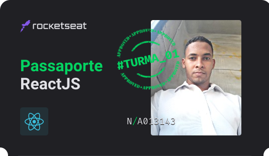

	

## Hiii! I'm Flávio Santos

<h2>Front End Developer</h2>

<h3>I’m currently working at Triplano using reactjs, nextjs, typescript, nodejs, adonisjs, react query, chakra-ui.</h3>

<h3>
	I'm specializing in nextjs, reactjs, react query, typescript, chakra-ui, styled-components,
	unit tests e more in Rocketseat.
</h3>

 

### 🛠 Tecnologias:

	
	
	
	
	
	
	
	
	
	
	
	
	
	
	
	

 

	<a href="https://github.com/flvSantos15">
	
	

	

	<li>Autoditada</li> <li>Focado</li> <li>Inglês Avançado</li> <li>CorelDraw</li> <li>Curioso</li> <li>Pro Ativo</li>

	
  
  ##
 

 
 	
 	
 	 

